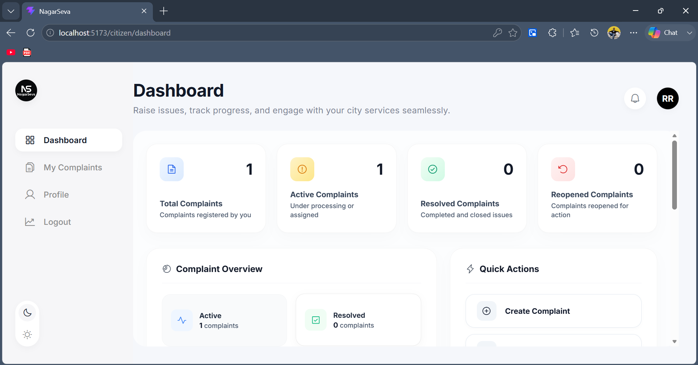
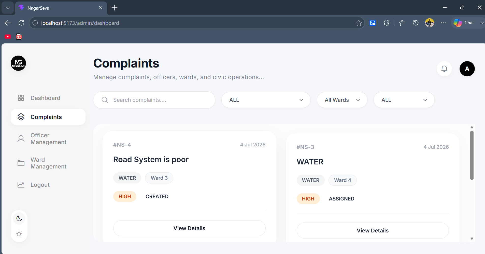
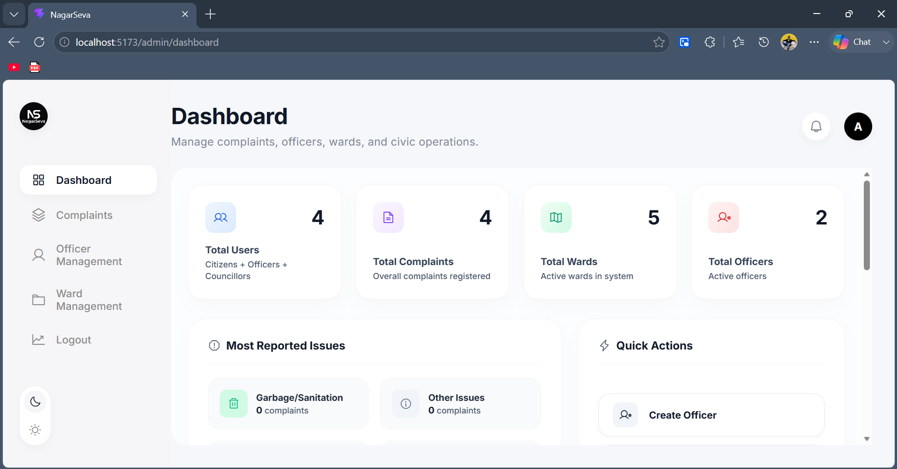
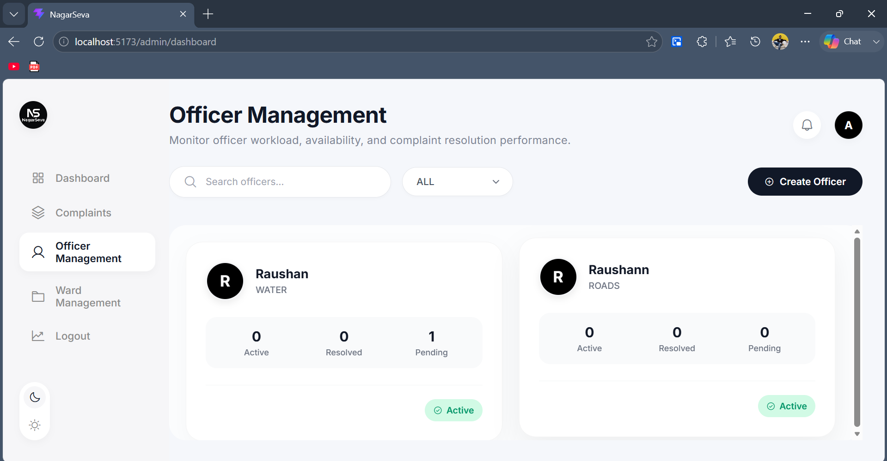
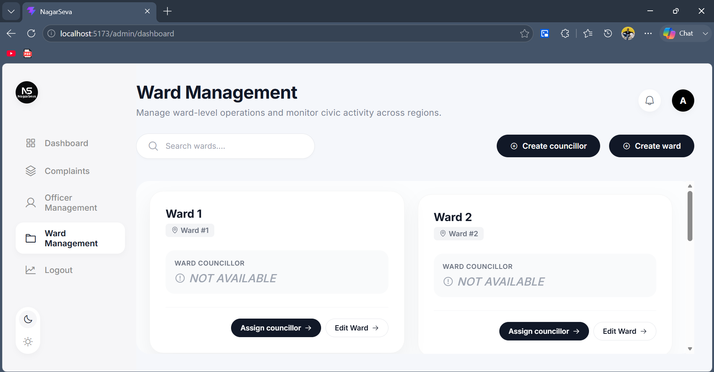

# 🏛️ NagarSeva - Smart Civic Complaint Management System

A full-stack civic complaint management system that enables citizens to report municipal issues, track complaint status, and allows officers and administrators to efficiently manage and resolve complaints.

---

## 🚀 Features

### 👨 Citizen
- User Registration & Login
- JWT Authentication
- Submit Complaints
- Upload Complaint Images
- Track Complaint Status
- View Complaint History
- Forgot Password (OTP via Email)

### 👮 Officer
- View Assigned Complaints
- Update Complaint Status
- Add Resolution Remarks

### 🏛️ Admin
- Manage Officers
- Assign Complaints
- Dashboard Analytics
- Manage Wards
- Monitor Complaint Progress

---

# 🛠️ Tech Stack

## Frontend
- React.js
- Vite
- Axios
- React Router
- Tailwind CSS

## Backend
- Java 21
- Spring Boot
- Spring Security
- Spring Data JPA
- JWT Authentication
- Maven

## Database
- PostgreSQL

## Third Party Services
- Cloudinary (Image Upload)
- Brevo (Email Service)

---

# 📂 Project Structure

```
NagarSeva
│
├── frontend
│   ├── src
│   ├── public
│   ├── package.json
│   └── ...
│
├── backend
│   ├── src
│   ├── pom.xml
│   ├── mvnw
│   └── ...
│
└── README.md
```

---

# ⚙️ Installation

## Clone Repository

```bash
git clone https://github.com/RahulRaushan1/nagarseva-fullstack.git
```

```
cd nagarseva-fullstack
```

---

# Backend Setup

```
cd backend
```

Configure `application.properties`

```properties
spring.datasource.url=jdbc:postgresql://localhost:5432/nagarseva
spring.datasource.username=YOUR_USERNAME
spring.datasource.password=YOUR_PASSWORD

cloudinary.cloud.name=YOUR_CLOUD_NAME
cloudinary.api.key=YOUR_API_KEY
cloudinary.api.secret=YOUR_API_SECRET

brevo.api.key=YOUR_BREVO_API_KEY
mail.sender=YOUR_EMAIL
```

Run Backend

```bash
mvn spring-boot:run
```

Backend URL

```
http://localhost:8080
```

---

# Frontend Setup

```
cd frontend
```

Install Dependencies

```bash
npm install
```

Run Frontend

```bash
npm run dev
```

Frontend URL

```
http://localhost:5173
```

---

# Database

Database Used

- PostgreSQL

Database Name

```
nagarseva
```

---

# Authentication

- JWT Authentication
- BCrypt Password Encryption
- Role Based Authorization

Roles

- Citizen
- Officer
- Councillor
- Admin

---

# APIs

### Authentication

- POST `/register`
- POST `/login`
- POST `/forgot-password`
- POST `/verify-otp`

### Citizen

- Create Complaint
- View Complaints
- Complaint History

### Admin

- Assign Complaint
- Manage Officers
- Dashboard

### Officer

- View Assigned Complaints
- Update Complaint Status

---

# Screenshots


### Citizen Dashboard



### Complaint Page



### Admin Dashboard



### Officer Management



### Ward Management


---

# Future Improvements

- SMS Notifications
- Push Notifications
- AI Complaint Categorization
- Complaint Location on Google Maps
- Mobile Application
- Analytics Dashboard

---

# Author

**Rahul Raushan**

GitHub

https://github.com/RahulRaushan1

LinkedIn

https://www.linkedin.com/in/rahulraushan1/

---

# License

This project is developed for educational and learning purposes.
````